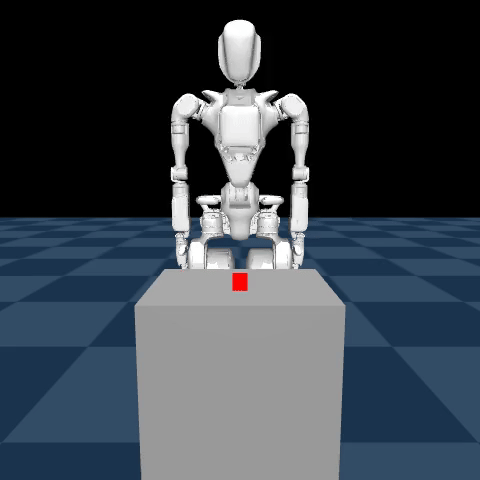

# Le-Probe: Probing LeWM

<div align="center">
  
</div>

Le-Probe is a research framework designed to analyze and compare **LeWM** against traditional **Vision-Language-Action (VLA)** policies like GR00T-N1.

My investigation focuses on high-DoF (32+) manipulation tasks that require multi-phase coordination, specifically comparing two distinct behavioral strategies: **Grasp** and **Cup**.

## 🚀 Repository Structure

- [**`dataset/`**](./dataset): Teleoperation and high-fidelity data collection (32-frame episodes).
- [**`vla/`**](./vla): GR00T-N1 baselines. Successfully demonstrates both Grasp and Cup behaviors.
- [**`lewm/`**](./lewm): World model training and Oracle MPC. Currently struggles with latent discriminability.
- [**`interpretability/`**](./interpretability): The "Search for the Why"—mechanistic analysis of LeWM failure modes.
- [**`scripts/`**](./scripts): Maintenance, dataset compression, and reward calibration tools.

## 🔬 Core Mission: VLA vs. LeWM

The project was born from a comparative study of two approaches to the same task: picking up a red cube.

### 1. Target Behaviors (Ground Truth)
I maintained two high-quality datasets representing different manipulation priors.

<div align="center">
  <table>
    <tr>
      <th>Dataset: Grasp Pattern</th>
      <th>Dataset: Cup Pattern</th>
    </tr>
    <tr>
      <td></td>
      <td></td>
    </tr>
  </table>
</div>

### 2. VLA Baseline Success (GR00T-N1)
I successfully trained GR00T-N1 to imitate both styles. Despite early protocol mismatches, the "Parity Refactor" stabilized the inference stack, allowing GR00T to execute both behaviors reliably.

More details available in [**`vla/README.md`**](./vla/README.md).

<div align="center">
  <table>
    <tr>
      <th>VLA: Grasp Execution</th>
      <th>VLA: Cup Execution</th>
    </tr>
    <tr>
      <td></td>
      <td></td>
    </tr>
  </table>
</div>

### 3. LeWM Challenges (The Discriminability Gap)
LeWM, despite training with a large softrank, failed to sufficiently discriminate the goal state from non-goal states in the latent space.

More details available in [**`lewm/README.md`**](./lewm/README.md).

#### Reward Head Intervention

To try and still get some sort of idea of the quality of training, I trained an auxiliary reward head on snapshot data with a broader range of trajectories predict the reward from the latent space. While reward prediction was much better, the MPC solver still didn't manage to actually pick up the cube and instead just got close to it and moved away as you can see in the video below.

<div align="center">
  <b>LeWM: Grasp Execution</b>
  <hr width="320">
  
</div>

#### Next Steps

Given the behaviour somewhat works but nowhere near good enough, the next step is to try and probe into the model if we can find certain sparse features. Given that my training run of the LeWM model ended up with a softrank of about 75, it is likely possible to identify certain sparse features that influence the latent space more than others.

### 4. Interpretability

#### Architecture

Following is the architecture used for experimenting with the trained model for interpretability,

<div align="center">
  
  <p><i>LeWM Interpretability: Mechanistic Analysis & Causal Intervention Stack</i></p>
</div>

#### Results

After training the CLT (details available in [**`interpretability/clt/`**](./interpretability/clt/)), there were 3 features that were firing at a large value at certain phases of the pickup in the training data (`gr1_pickup_grasp`):

| Feature | Label | Max Act. | Episode | Frame Index | Phase |
| :--- | :--- | :--- | :--- | :--- | :--- |
| **358** | **Spatial Lockdown** | **2.0461** | 111 | 27 | Lift (Post-Grip) |
| **90** | **Tactile Engagement** | **1.5157** | 115 | 23 | Grasp (Coupling) |
| **743** | **Alignment Precision** | **1.5508** | 19 | 25 | Grasp-to-Lift Handover |

Following are the plots demonstrating the transition of states triggering the above features:

<div align="center">
  <p>Spatial Lockdown</p>
  
</div>

<div align="center">
  <p>Tactile Engagement</p>
  
</div>

<div align="center">
  <p>Alignment Precision</p>
  
</div>

#### Next Steps

Given we now have an interpretable latent space, it would help identify the effects of the following changes to the training pipeline:
1. **Multi-View Data:** Currently LeWM was only trained with the front camera (`world_center`), unlike GR00T that was trained on 5 different views (`world_center`, `world_right`, `world_left`, `world_top` and `world_wrist`). Training LeWM with 5 views would require further tweaks to the pipeline but is likely to lead to more effective discrimination between goal states and non-goal states.
2. **Reachability:** Another potential improvement could be achieved by using kinematic polytopes (using tools like PyCapacity) around the right arm in particular, to further guide the model for avoiding catastrophic failures like folding the arm behind the back or lifting it in the air. Neither of these failure modes were part of the dataset as a result of which it's likely that the model hasn't learned to avoid them and it's not feasible to have all failure modes in the dataset given the number of degrees of freedom.

## 🛠 Getting Started

```bash
# 1. Install
git clone --recursive https://github.com/vedpatwardhan/le-probe.git
cd le-probe && python3 -m venv .venv && source .venv/bin/activate
pip install -r requirements.txt
```

### 1. Data Collection & Datasets

I have published three core datasets used for the above results:
- [**`gr1_pickup_grasp`**](https://huggingface.co/datasets/vedpatwardhan/gr1_pickup_grasp): Precision "pinch" grasp trajectories.
- [**`gr1_pickup_cup`**](https://huggingface.co/datasets/vedpatwardhan/gr1_pickup_cup): Robust "surrounding" containment trajectories.
- [**`gr1_reward_pred`**](https://huggingface.co/datasets/vedpatwardhan/gr1_reward_pred): Multi-behavioral data used to train the Reward Head.

Optionally, if you'd like to record new datasets you can use the following:
```bash
# Terminal 1: Simulation Server
.venv/bin/python dataset/simulation_teleop.py

# Terminal 2: Dashboard
streamlit run dataset/teleop_ui.py
```

### 2. VLA (GR00T-N1)

#### Training

The model was trained using [**`vla/GR00T_N1_BC.ipynb`**](vla/GR00T_N1_BC.ipynb)

To run the stabilized VLA policy in simulation, the model weights/configs are available at the following folders:

| Type of Movement | Google Drive Link |
| --- | --- |
| **Grasp** | [pretrained_model](https://drive.google.com/drive/folders/1077_msVzs_8AQPaEbDm6XPiq8T_hxirp?usp=sharing) |
| **Cup** | [pretrained_model](https://drive.google.com/drive/folders/1f5p6-5p6_20PpfbONcq-n5T1P7DhHfBw?usp=sharing) |


#### Inference

1. **Inference Server**: Was run using [**`vla/GR00T_N1_E2E.ipynb`**](vla/GR00T_N1_E2E.ipynb) using a Pinggy tunnel.
   ```bash
   .venv/bin/python vla/gr00t_server.py --weights <path to pretrained_model folder>
   ```

2. **Simulation Host**:
   ```bash
   .venv/bin/python vla/simulation_vla.py --host <host> --port <port> --chunks <num_chunks>
   ```

### 3. LeWM + CEM/MPC

#### Training

The model was trained using [**`lewm/LeWM_Training.ipynb`**](lewm/LeWM_Training.ipynb). The original model was trained under the `GR-1 Pickup Grasp` section and the reward head was separately trained under the `GR-1 Reward Pred` section.

Following the training, all goal states in the dataset were harvested in the latent space using [**`lewm/harvest_goals.py`**](lewm/harvest_goals.py) to save inference time.

The weights of the reward-tuned model can be found at [`gr1_reward_tuned_v2.ckpt`](https://drive.google.com/file/d/12YDes7GSQRWzQ-IMHbpq_64oWEoYj96V/view?usp=sharing) and the harvested goals can be found at [`goal_gallery.pth](https://drive.google.com/file/d/1l-jdRkcwUUYxLcDiyDS6pb59M-CeZfSf/view?usp=sharing).

#### Inference

1. **Inference Server**: Was run using [**`lewm/LEWM_E2E.ipynb`**](lewm/LEWM_E2E.ipynb) using a Pinggy tunnel.
   ```bash
   .venv/bin/python lewm/lewm_server.py --model gr1_reward_tuned_v2.ckpt --gallery goal_gallery.pth
   ```

2. **Simulation Host**:
   ```bash
   .venv/bin/python lewm/simulation_lewm.py --host <host> --port <port>
   ```

---
*Developed by Ved Patwardhan.*
