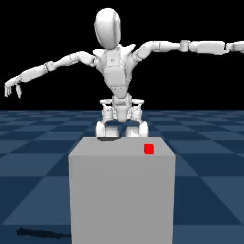
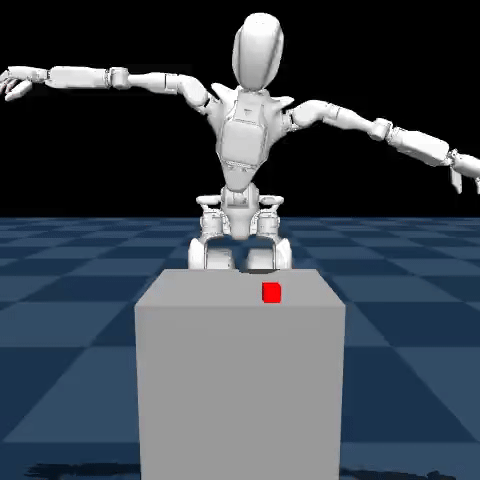
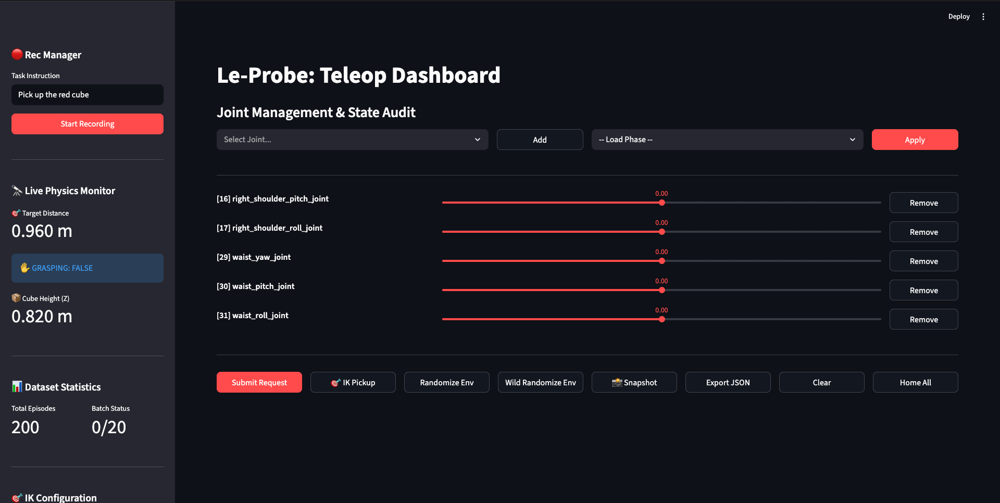

# Dataset Management & Teleoperation

This module handles the lifecycle of robotic data: from real-time MuJoCo teleoperation to LeRobot-formatted cloud datasets.

## 📊 Dataset Standards

I have standardized on **32-frame episodes** (recorded at 10Hz) to capture the full reach-to-grasp trajectory. I maintain two primary behavioral variants:

<div align="center">
  <h3>1. gr1_pickup_grasp</h3>
  <p>Precision-oriented data focusing on biomechanically aligned finger placement and "pinch" grasps.</p>
  

  <h3>2. gr1_pickup_cup</h3>
  <p>A "cup-style" movement where the hand surrounds the object, providing a robust containment baseline.</p>
  
</div>

### Data Quality Auditing:
Through bulk assessment of 150+ episodes, I identified that 32-frame windows provide the optimal balance between temporal resolution and training stability for both VLA and World Model architectures.

## 🖥 Teleoperation Interface

I use a custom-built Streamlit dashboard for real-time control, IK requests, and dataset auditing.

<div align="center">
  
</div>

## 🛠 Key Components

- [**`teleop_ui.py`**](teleop_ui.py): Streamlit dashboard for 32-DoF joint control and IK-assisted manipulation.
- [**`simulation_teleop.py`**](simulation_teleop.py): ZMQ server driving the MuJoCo simulation and handling 32-DoF IK requests.
- [**`lerobot_manager.py`**](lerobot_manager.py): Core recording logic. Implements the 32-dim identity protocol and "Smart Reward" injection.
- [**`simulation_replay.py`**](simulation_replay.py): Visual audit tool for replaying recorded episodes.

## 🚀 Workflows

### 1. Data Collection
```bash
# Start Sim Server
.venv/bin/python dataset/simulation_teleop.py

# Start Dashboard
streamlit run dataset/teleop_ui.py
```

### 2. High-Performance Upload
```bash
.venv/bin/python dataset/upload_dataset.py --repo_id vedpatwardhan/gr1_pickup_grasp
```
