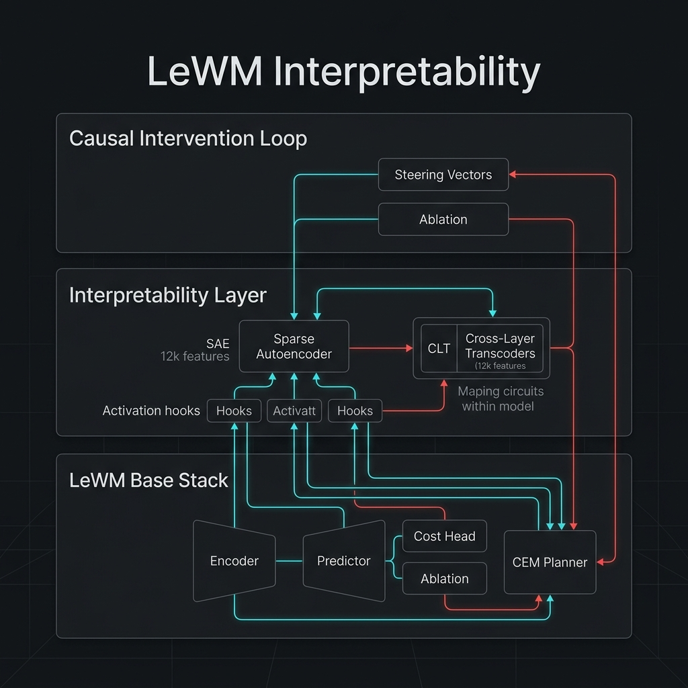
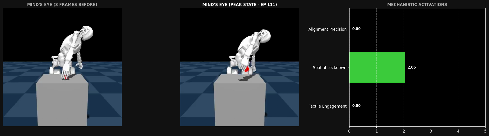
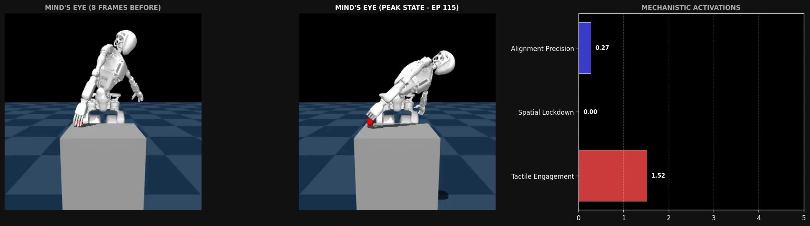
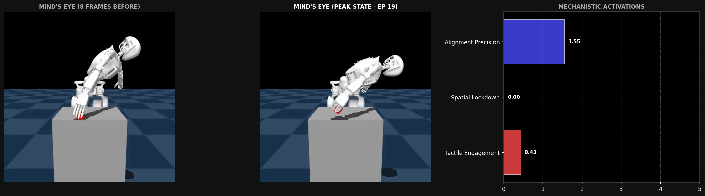
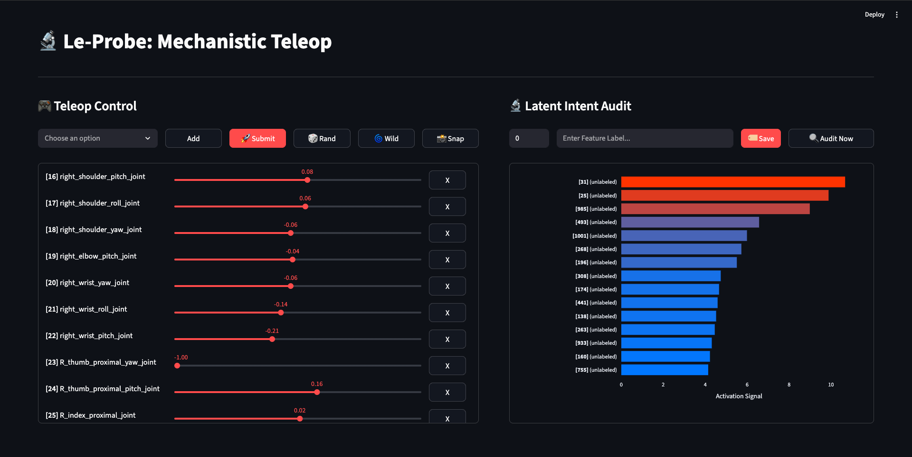

# Interpretability: Probing the Latent Mystery

As we saw in the [**`lewm/README.md`**](../lewm/README.md), LeWM struggles with **Latent Discriminability**—the inability to find a clear path to the goal in the latent manifold for our dataset.

This motivated the need for a deeper understanding of the latent space for our model before attempting further improvements to the model and the training pipeline as a whole.

## 📐 Methodology

Following is the architecture used for experimenting with the trained model for interpretability,

<div align="center">
  
  <p><i>LeWM Interpretability: Mechanistic Analysis & Causal Intervention Stack</i></p>
</div>

### 🛠 Key Components

- [`sae`]: Sparse Autoencoders for getting more interpretable features out of the model
- [`clt`]: Cross-Layer Transcoders for understanding how those features compound through the network.
- [`steering`]: Latent Steering used for interpretability (hasn't been tried yet).
- [`teleop_ui_interpret.py`]: Dashboard to view the top 15 features triggered the most by a given state-action configuration in a bar plot.
- [`simulation_teleop_interpret.py`]: A simplified version of [`dataset/simulation_teleop.py`] for the features that are needed with static brain snapshots to complement the activation plot.
- [`latent_server.py`]: Server used to compute features with the most activation, used by the dashboard to contruct the bar plot.

### 🏗 Process

We have implemented a three-phase mechanistic interpretability stack that operates with **Zero-Impact Modularity** (using PyTorch hooks to avoid modifying the core `lewm` code).

#### 🍎 Phase I: The SAE Harvest (`/sae`)
To "crack" the 192d latent bottleneck, we perform a **Data Harvest**.
- **Instrumentation**: `activation_harvester.py` attaches hooks to the `Predictor` and `Encoder`.
- **Data Crop**: `harvest_activations.py` runs ~1,000 diverse simulation episodes.
- **Decomposition**: `train_sae.py` trains a **Sparse Autoencoder** to map dense latents to 12,000+ monosemantic physical features (e.g., "gripper-cube contact").

#### ⚡ Phase II: Circuit Tracing (`/clt`)
Once features are isolated, we use **Cross-Layer Transcoders (CLTs)** to understand the model's logic.
- **Mechanism**: `clt_model.py` maps features from one layer/time-step directly to the next.
- **Goal**: Tracing "verbs" (e.g., *how* an action causes a state change) by linearizing the Predictor's internal MLP.

## 🔬 Results

After training the CLT, we successfully isolated three core mechanistic features that define the GR-1 pickup sequence in the `gr1_pickup_grasp` dataset:

| Feature | Label | Max Act. | Episode | Frame Index | Phase Context |
| :--- | :--- | :--- | :--- | :--- | :--- |
| **358** | **Spatial Lockdown** | **2.0461** | 111 | 27 | Lift (Post-Grip) |
| **90** | **Tactile Engagement** | **1.5157** | 115 | 23 | Grasp (Coupling) |
| **743** | **Alignment Precision** | **1.5508** | 19 | 25 | Grasp-to-Lift Handover |

Following are the plots demonstrating the transition of states triggering the above features:

<div align="center">
  <p>Spatial Lockdown</p>
  
</div>

<div align="center">
  <p>Tactile Engagement</p>
  
</div>

<div align="center">
  <p>Alignment Precision</p>
  
</div>

## 👀 Visualization

A dashboard has been added to view the top 15 features that were triggered the most for a given state-action configuration:

<div align="center">
  <p>Mechanistic Teleop Dashboard</p>
  
</div>

## 🚀 Research Roadmap: Next Steps

The discovery of these interpretable features allows us to audit the effects of key architectural changes:

1. **Multi-View Data:** Currently LeWM was only trained with the front camera (`world_center`), unlike GR00T that was trained on 5 different views (`world_center`, `world_right`, `world_left`, `world_top` and `world_wrist`). Training LeWM with 5 views would require further tweaks to the pipeline but is likely to lead to more effective discrimination between goal states and non-goal states.
2. **Reachability:** Another potential improvement could be achieved by using kinematic polytopes (using tools like PyCapacity) around the right arm in particular, to further guide the model for avoiding catastrophic failures like folding the arm behind the back or lifting it in the air. Neither of these failure modes were part of the dataset as a result of which it's likely that the model hasn't learned to avoid them and it's not feasible to have all failure modes in the dataset given the number of degrees of freedom.
3. **Behavioural Strategies:** Currently our training was focused just on the grasp movement, but once that behaviour works reasonably well, the next goal would be training the model on the cup movement as well.
4. **Latent Steering**: Closing the causal loop by using Feature 90 (Tactile Engagement) as a reward booster during real-time inference.

## 🚀 Workflows

### 0. Pre-trained Artifacts

- [`activations_dual_14k.pt`](https://drive.google.com/file/d/169G_KAaQXCUbFH4wu6u5eoYFU9qInb2u/view?usp=sharing): Harvested latents from ENC and PRED.
- [`sae_weights.pt`](https://drive.google.com/file/d/12rrdjf1GKd_1OEVFzBI-lhNzc30yFYiQ/view?usp=sharing): Trained Sparse Autoencoder.
- [`clt_weights.pt`](https://drive.google.com/file/d/1PQCZYzIGhRAh8FcxYyHV4-Sac7Ap2v_v/view?usp=sharing): Trained Cross-Layer Transcoder.

### 1. Activation Harvesting
Collect raw latents from the frozen World Model to build the interpretability dataset:
```bash
# Harvests ENC and PRED latents across snapshots and LeRobot datasets
.venv/bin/python interpretability/sae/harvest_activations.py --out activations_dual_14k.pt
```

### 2. Feature Training (SAE & CLT)
Decompose the latent space and train cross-layer transcoders:
```bash
# 1. Train Sparse Autoencoder on harvested latents
.venv/bin/python interpretability/sae/train_sae.py --input activations_dual_14k.pt --dict_size 1024 --l1 1e-3

# 2. Inspect SAE Features
.venv/bin/python interpretability/sae/inspect_sae.py --latents activations_dual_14k.pt --sae sae_weights.pt

# 3. Train Cross-Layer Transcoder to map features across the transformer
.venv/bin/python interpretability/clt/train_clt.py --input activations_dual_14k.pt --dict_size 1024

# 4. Inspect CLT
.venv/bin/python interpretability/clt/inspect_clt.py --clt clt_weights.pt --data activations_dual_14k.pt
```

### 3. Mechanistic Audit & Feature Discovery
Identify "Golden Triggers" and visualize the model's internal representations:
```bash
# 1. Find peak activation frames for specific features (e.g., Feature 90)
.venv/bin/python scripts/find_feature_triggers.py --feature 90

# 2. Generate bit-perfect canonical triptychs for found triggers
.venv/bin/python scripts/generate_canonical_triptychs.py
```

### 4. Canonical State Reproduction
Extract precise joint vectors and images for reproduction in the simulation:
```bash
# Harvests 32-dim action vectors and high-res images to le-probe/temp_repro
.venv/bin/python scripts/reproduce_canonical_states_direct.py
```

### 5. Mechanistic Teleoperation
Observe the top 15 features activated by any set of actions controlled through the sliders.
```bash
# 1. Start the simulation
.venv/bin/python interpretability/simulation_teleop_interpret.py

# 2. Start the latent server
.venv/bin/python interpretability/latent_server.py

# 3. Start the dashboard
.venv/bin/python interpretability/teleop_ui_interpret.py
```