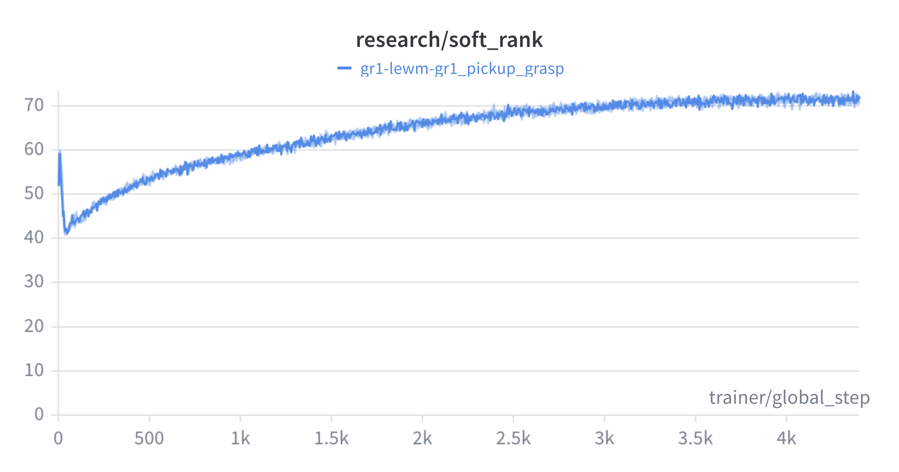
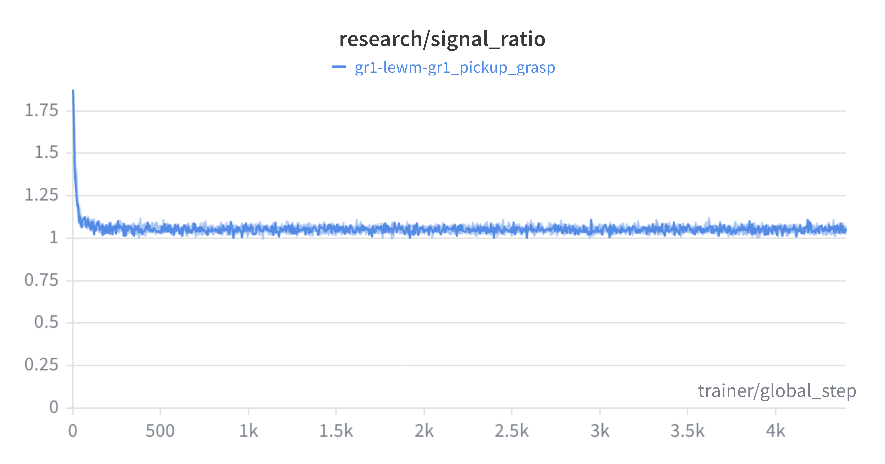
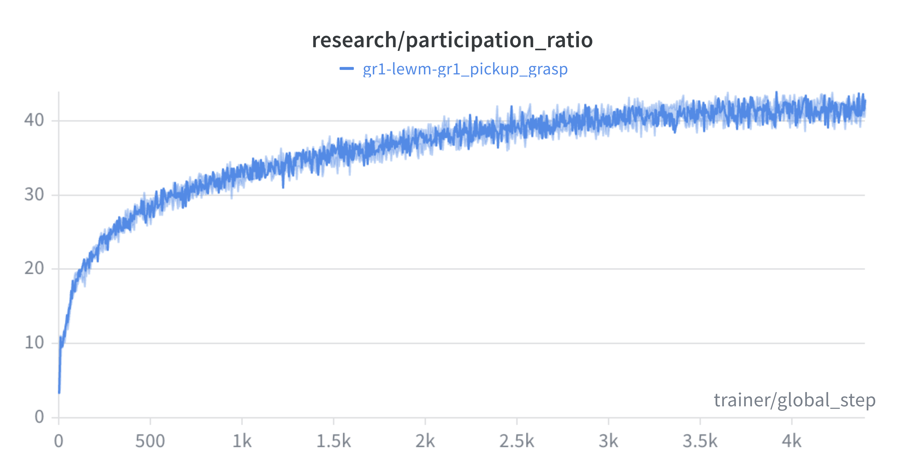
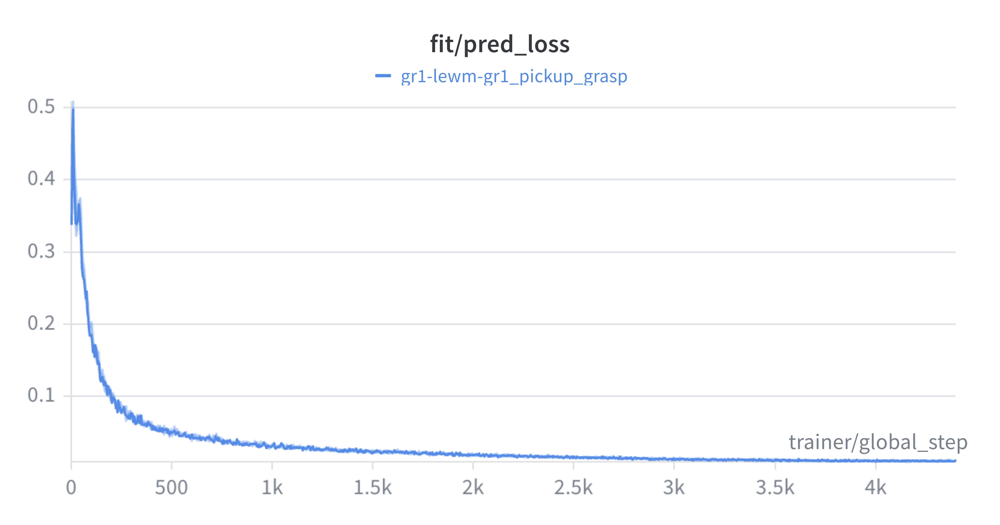
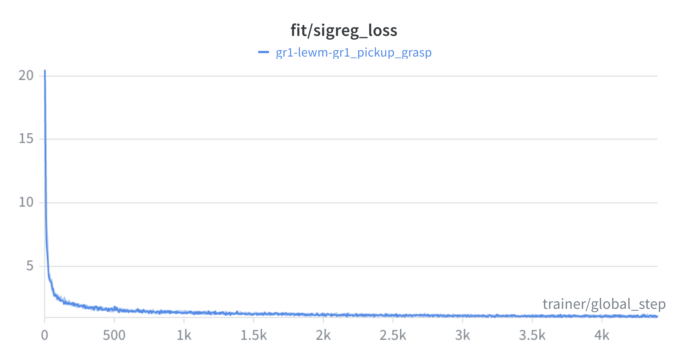
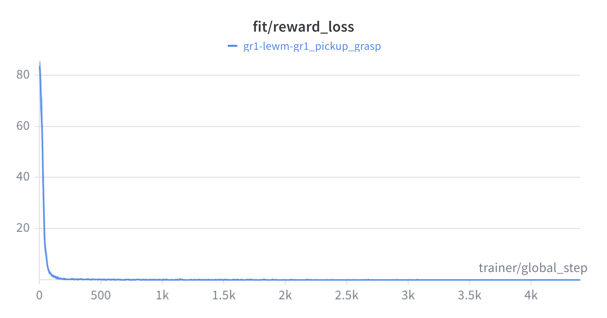

# LeWM: LeRobot World Model & Oracle MPC

This module implements the **LeWM** (LeRobot World Model) training and inference stack, using a JEPA-based architecture for latent imagination and Oracle MPC for planning.

## 📐 Methodology

The model was first trained on the `gr1_pickup_grasp` dataset using [**`LeWM_Training.ipynb`**](LeWM_Training.ipynb), then given the poor performance of discriminating between goal and non-goal states, an additional reward model tuning was performed in the same notebook.

Finally, the performance was evaluated using [**`LEWM_E2E.ipynb`**](LEWM_E2E.ipynb) and [**`simulation_lewm.py`**](simulation_lewm.py).

### 🛠 Key Components

- [`LeWM_Training.ipynb`](LeWM_Training.ipynb): Notebook used for training the LeWM and reward head.
- [`train_lewm.py`](train_lewm.py): Core training logic for the world model and reward head.
- [`gr1_modules.py`](gr1_modules.py): Additional modules for adapting the LeWM for Fourier GR-1.
- [`lewm_data_plugin.py`](lewm_data_plugin.py): Custom data plugin for LeWM.
- [`metrics.py`](metrics.py): Training metrics observed including softrank, signal ratio, partcipant ratio, etc.
- [`tune_reward_head.py`](tune_reward_head.py): A utility to tune the reward head of the LeWM with additional snapshots.
- [`harvest_goals.py`](harvest_goals.py): Utility to pre-compute goal embeddings for testing.
- [`diagnose_mpc.py`](diagnose_mpc.py): A utility to visualize the CEM planner's latent trajectory (the planning algorithm). This is not an online server but just a sanity check after training.
- [`LeWM_E2E.ipynb`](LeWM_E2E.ipynb): Notebook to run the server for the model (tunneled through Pinggy).
- [`lewm_server.py`](lewm_server.py): The ZMQ inference host used in the notebook.
- [`goal_mapper.py`](goal_mapper.py): Manages latent goal memory and manifold traversal.
- [`goal_utils.py`](goal_utils.py): Utilities for handling goal embeddings.
- [`simulation_lewm.py`](simulation_lewm.py): MuJoCo simulation environment for LeWM testing.

## 📊 Results

Here are some of the training metrics:

<div align="center">
  <table>
    <tr>
      <td><br><b>Softrank</b></td>
      <td><br><b>Signal Ratio</b></td>
      <td><br><b>Participation Ratio</b></td>
    </tr>
    <tr>
      <td><br><b>Prediction Loss</b></td>
      <td><br><b>SigReg Loss</b></td>
      <td><br><b>Reward Loss</b></td>
    </tr>
  </table>
</div>

As can be seen, the softrank ends up close to a 60-90 range which was initially expected based on the dataset without colapsing lower than 45 at the start of training and the sigreg loss also drops significantly indicating that we're able to capture the dynamics without representation collapse.

## 🏆 Current Performance

The results with solely relying on the goal state embeddings weren't useful, but after training with an auxillary reward head instead, the robot atleast managed to get close to the table but not able to close in on the cube.

<div align="center">
  <b>LeWM: Grasp Execution (Reward Head Trained)</b>
  <hr width="320">
  
</div>

## ⚠️ Current Challenges: The Discriminability Gap

My research shows that while LeWM can learn to predict video frames accurately, it struggles with the **Latent Discriminability Gap**:

- **Latent Confusion**: The world model often fails to distinguish the final goal state from intermediate states in the latent manifold, leading to "stalled" planning.
- **Reward Head Intervention**: I use an auxiliary **Reward Predictor** to provide a clearer gradient for the MPC solver. This has shown improvement in the robot's movement intent, though smoothness still trails behind VLA baselines.

The above thus motivated the need for interpretability, covered in [**`interpretability/README.md`**](../interpretability/README.md).

## 🚀 Workflows

### 1. Training
The model is trained using [**`LeWM_Training.ipynb`**](LeWM_Training.ipynb).
- **General Training**: Performed under the `GR-1 Pickup Grasp` section.
- **Reward Head Tuning**: Performed under the `GR-1 Reward Pred` section.

After training, use [**`harvest_goals.py`**](harvest_goals.py) to harvest latent goal embeddings into a gallery.

**Pre-trained Artifacts:**
- [`gr1_reward_tuned_v2.ckpt`](https://drive.google.com/file/d/12YDes7GSQRWzQ-IMHbpq_64oWEoYj96V/view?usp=sharing): Reward-tuned checkpoint.
- [`goal_gallery.pth`](https://drive.google.com/file/d/1l-jdRkcwUUYxLcDiyDS6pb59M-CeZfSf/view?usp=sharing): Harvested latent goal gallery.

### 2. Inference
To test the World Model and MPC planner:

1. **LeWM MPC Server**: Start the server with the tuned model and gallery, I've done that in the [**`LEWM_E2E.ipynb`**](LEWM_E2E.ipynb) notebook.
   ```bash
   python lewm/lewm_server.py --model gr1_reward_tuned_v2.ckpt --gallery goal_gallery.pth
   ```
2. **Simulation Host**: Start the MuJoCo environment.
   ```bash
   python lewm/simulation_lewm.py --host <host> --port <port>
   ```
