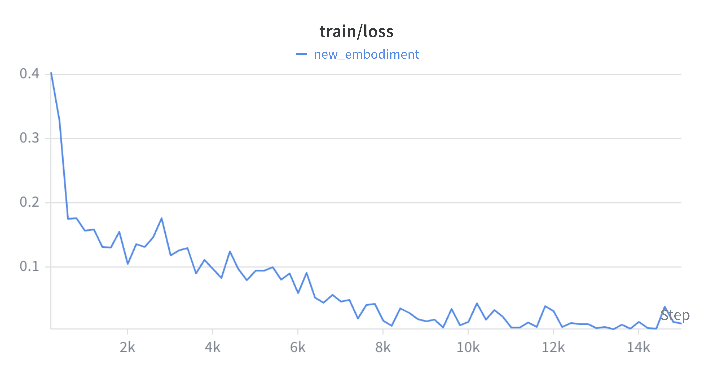
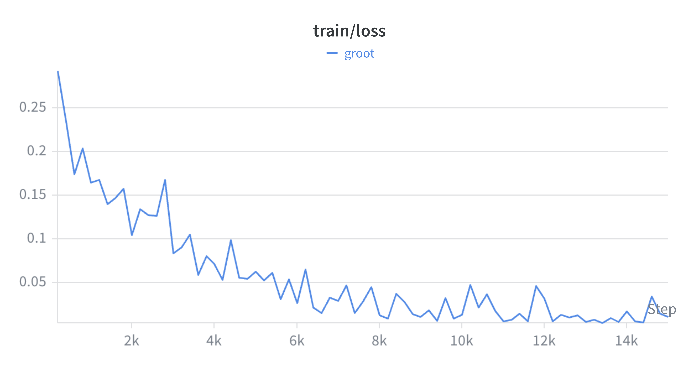

# VLA: Vision-Language-Action Baselines

This module contains all the code that was used for training and inference of the **GR00T-N1** model with both of our datasets.

## 📐 Methodology

The model was trained using the behavioral cloning pipeline in [**`GR00T_N1_BC.ipynb`**](GR00T_N1_BC.ipynb).

For evaluating the trained model, we used the [**`GR00T_N1_E2E.ipynb`**](GR00T_N1_E2E.ipynb) notebook to execute the model and [**`simulation_vla.py`**](simulation_vla.py) to run the simulation connecting to that model.

### 🛠 Key Components

- [`GR00T_N1_BC.ipynb`](GR00T_N1_BC.ipynb): Behavioral Cloning training and audit logs.
- [`GR00T_N1_E2E.ipynb`](GR00T_N1_E2E.ipynb): End-to-end evaluation pipeline.
- [`gr00t_server.py`](gr00t_server.py): The ZMQ inference host.
- [`simulation_vla.py`](simulation_vla.py): MuJoCo simulation environment for VLA testing.

## 📊 Results

Following are the loss plots while training both the cup and grasp datasets for 15k steps:

<div align="center">
  <table>
    <tr>
      <th>Grasp</th>
      <th>Cup</th>
    </tr>
    <tr>
      <td></td>
      <td></td>
    </tr>
  </table>
</div>

## 🏆 Current Performance

GR00T-N1 has been successfully stabilized to perform two distinct manipulation styles on a 32-DoF humanoid platform:

<div align="center">
  <table>
    <tr>
      <th>Grasp Execution</th>
      <th>Cup Execution</th>
    </tr>
    <tr>
      <td></td>
      <td></td>
    </tr>
  </table>
</div>

## 🚀 Workflows

### 1. Training

The model was trained using the behavioral cloning pipeline in [**`GR00T_N1_BC.ipynb`**](GR00T_N1_BC.ipynb).

Pre-trained model weights are available on Google Drive:
| Behavior | Pretrained Model Link |
| --- | --- |
| **Cup** | [Download](https://drive.google.com/drive/folders/1f5p6-5p6_20PpfbONcq-n5T1P7DhHfBw?usp=sharing) |
| **Grasp** | [Download](https://drive.google.com/drive/folders/1077_msVzs_8AQPaEbDm6XPiq8T_hxirp?usp=sharing) |

### 2. Inference
To run the stabilized VLA policy in simulation:

1. **Inference Server**: Start the server (I'm tunnelling from [**`GR00T_N1_E2E.ipynb`**](GR00T_N1_E2E.ipynb) on Colab using Pinggy).
   ```bash
   .venv/bin/python vla/gr00t_server.py --weights <path to pretrained_model folder>
   ```

2. **Simulation Host**: Start the MuJoCo environment.
   ```bash
   python vla/simulation_vla.py --host <host> --port <port> --chunks <num_chunks>
   ```
