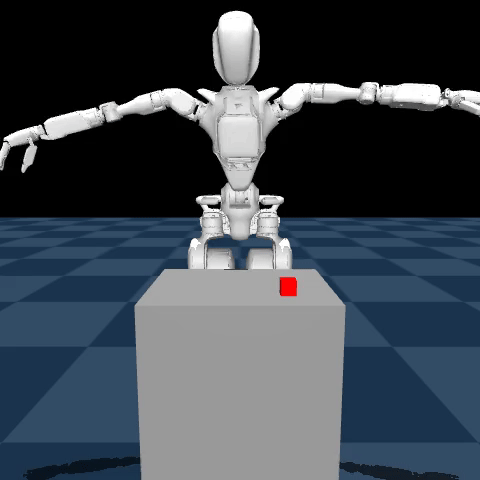
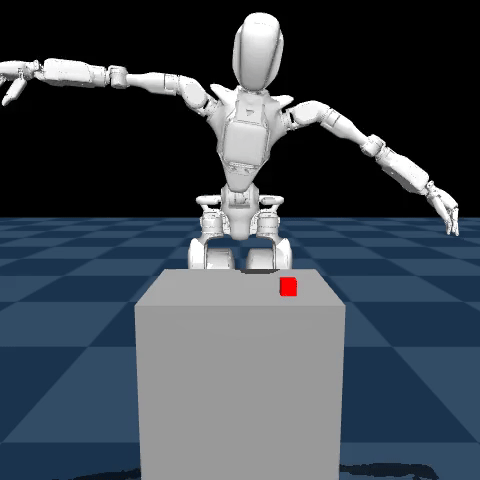

# VLA: Vision-Language-Action Baselines

This module hosts the **GR00T-N1** inference server and evaluation notebooks. Our VLA implementation serves as the high-performance baseline for comparing World Model (LeWM) behaviors.

## 🏆 Current Performance

GR00T-N1 has been successfully stabilized to perform two distinct manipulation styles on a 32-DoF humanoid platform:

  <h3>1. Grasp Pattern</h3>
  
Precision approach and pinch-grasp of the cube.

  

  <h3>2. Cup Pattern</h3>
  
A "surrounding" movement optimized for containment rather than friction-based grasping.

  

### Implementation Success:
Our 15k-step baseline was stabilized by achieving bit-perfect normalization parity with the training stack. This resolved early divergence issues where the model's reaching intent was correct but the physical execution was biased by unscaled joint values.

## 📁 Key Files
- [`gr00t_server.py`](gr00t_server.py): The ZMQ inference host.
- [`GR00T_N1_E2E.ipynb`](GR00T_N1_E2E.ipynb): End-to-end evaluation pipeline.
- [`GR00T_N1_BC.ipynb`](GR00T_N1_BC.ipynb): Behavioral Cloning training and audit logs.
