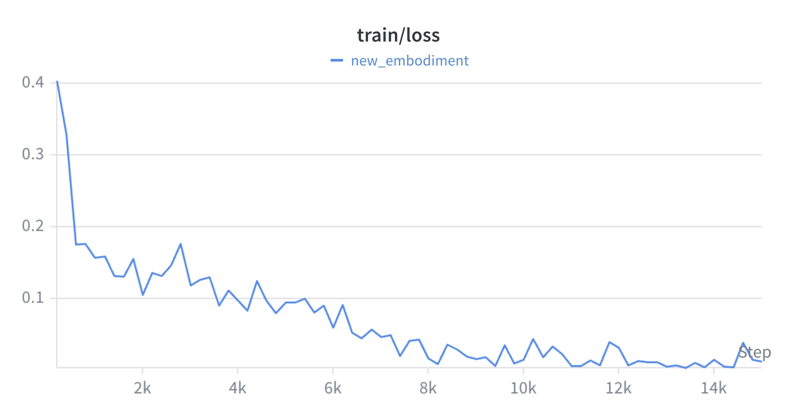
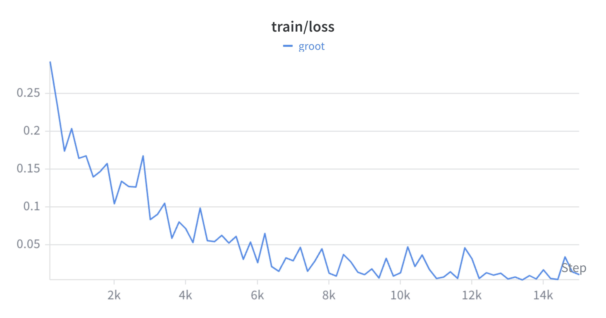
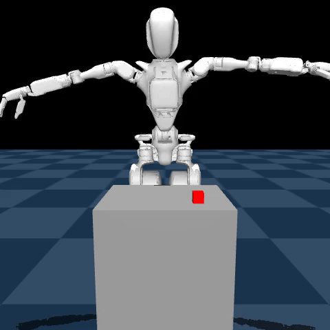
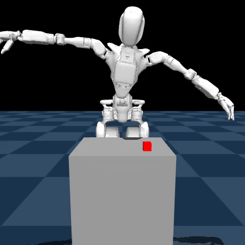

# VLA Baseline: GR00T-N1

This module contains the Vision-Language-Action baseline used as behavioral context for Le-Probe.

## Why It Exists

- Establishes that behavior-style imitation (grasp vs cup) is learnable with a policy baseline.
- Serves as a reference point against world-model latent planning behavior.

## Files

- [`GR00T_N1_BC.ipynb`](./GR00T_N1_BC.ipynb): behavioral cloning training.
- [`GR00T_N1_E2E.ipynb`](./GR00T_N1_E2E.ipynb): end-to-end evaluation.
- [`gr00t_server.py`](./gr00t_server.py): inference server.
- [`simulation_vla.py`](./simulation_vla.py): MuJoCo client.

## Setup

```bash
cd le-probe
python3 -m venv .venv
source .venv/bin/activate
pip install -r requirements.txt
```

## Training Signal

<div align="center">
  
  
</div>

## Rollout Examples

<div align="center">
  
  
</div>

## Minimal Inference Workflow

```bash
# Start inference host
.venv/bin/python vla/gr00t_server.py --weights <path_to_pretrained_model> -p 5555

# Run simulation
.venv/bin/python vla/simulation_vla.py --base_url https://<id>.ngrok-free.app --chunks <num_chunks>
```
